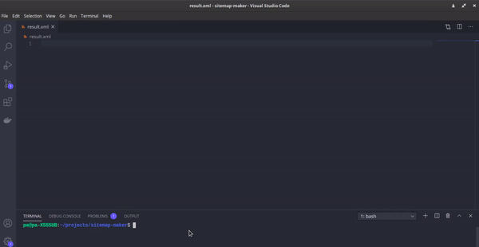

# sitemap-maker

A simple tool to make [sitemap.xml](https://www.sitemaps.org/protocol.html) from a baseUrl using [anchor-finder](https://github.com/ap-pauloafonso/anchor-finder) and breadth first search algorithm.

## Usage
`go run sitemapmaker.go -url [url] -depth [depth number] > [result_name.xml]`

if depth parameter is not provided then it will use 3 as the default number

